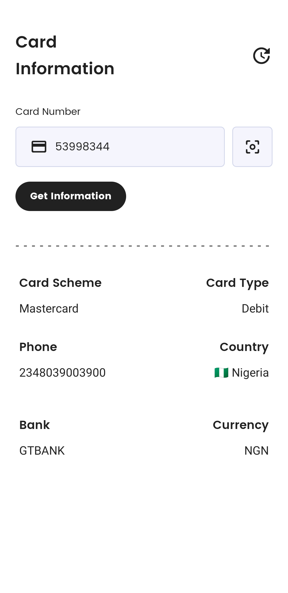

# Android Build 

# A mini project to display information about a card, making API calls to https://binlist.io

## Features
* MVVM Architecture
* Kotlin Coroutines with Flow
* Dagger Hilt
* Kotlin Gradle DSL
* GitHub actions for CI
* Unit testing

 

## Libraries

- [Viewmodel](https://developer.android.com/topic/libraries/architecture/viewmodel) - Presenter for persisting view state across config changes
- [Room Database](https://developer.android.com/training/data-storage/room) - Provides abstraction layer over SQLite
- [Retrofit](https://square.github.io/retrofit/) - type safe http client and supports coroutines out of the box.  
- [Moshi](https://github.com/square/moshi) - JSON Parser,used to parse requests on the data layer for Entities and understands Kotlin non-nullable and default parameters
- [okhttp-logging-interceptor](https://github.com/square/okhttp/blob/master/okhttp-logging-interceptor/README.md) - logs HTTP request and response data.
- [kotlinx.coroutines](https://github.com/Kotlin/kotlinx.coroutines) - Library Support for coroutines,provides `runBlocking` coroutine builder used in tests
- [Truth](https://truth.dev/) - Assertions Library,provides readability as far as assertions are concerned
- [Retromock](https://github.com/infinum/Retromock) - web server for testing HTTP clients
- [Robolectric](http://robolectric.org/) - Unit test on android framework.
- [Espresso](https://developer.android.com/training/testing/espresso) - Test framework to write UI Tests
- [Dagger Hilt](https://dagger.dev/hilt) - handles dependency injection
- [Work Manager](https://developer.android.com/topic/libraries/architecture/workmanager) - the recommended solution for persistent work

 

## App Screenshots
 
